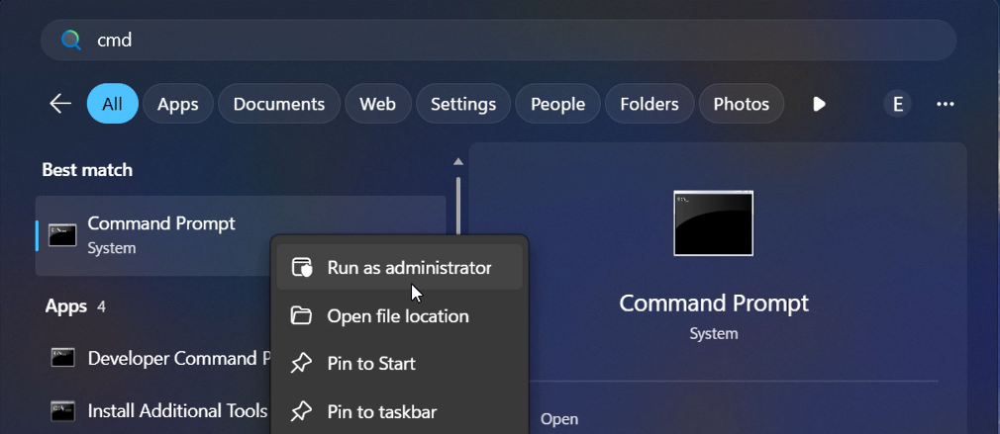
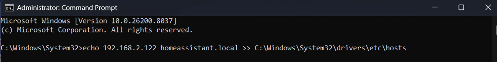

# SmartHub — AI-Powered Smart Home

Control your Home Assistant with natural language through Discord, Teams, or Feishu. Powered by OpenClaw.

## How It Works

```
  "Turn off the lights"         "Set AC to 24"         "I'm leaving for work"
          │                          │                          │
          └──────────────────────────┼──────────────────────────┘
                                     │
                                     ▼
                        ┌────────────────────────┐
                        │   Discord / Teams /    │
                        │       Feishu           │
                        └───────────┬────────────┘
                                    │
                                    ▼
                        ┌────────────────────────┐
                        │      OpenClaw          │
                        │   (AI agent, Claude)   │
                        │                        │
                        │  Reads skill files in  │
                        │  tools/ to know how    │
                        │  to control devices    │
                        └───────────┬────────────┘
                                    │
                                    ▼
                        ┌────────────────────────┐
                        │    SmartHub API         │
                        │   (Bun / Elysia)       │
                        │                        │
                        │  WebSocket to HA,      │
                        │  device aggregation,   │
                        │  error recovery        │
                        └───────────┬────────────┘
                                    │
                                    ▼
                        ┌────────────────────────┐
                        │   Home Assistant        │
                        │      (Docker)           │
                        └───────────┬────────────┘
                                    │
                    ┌───────────────┼───────────────┐
                    ▼               ▼               ▼
                 Lights           AC/TV          Sensors
                Switches        Cameras         Cookers
```

Say "I'm leaving for work" and OpenClaw turns off lights, sets the AC to eco, and confirms what it did.

---

## Quick Install

**Already have OpenClaw running?** Just tell your bot:

> Run this: `curl -fsSL https://raw.githubusercontent.com/caiwang0/smarthome-openclaw/main/install.sh -o /tmp/smarthub-install.sh && bash /tmp/smarthub-install.sh`

OpenClaw will install everything and walk you through setup automatically.

---

## Full Setup

Three manual steps, then OpenClaw guides you through everything else.

### 1. Install OpenClaw

**macOS / Linux:**

```bash
curl -fsSL https://openclaw.ai/install.sh | bash -s -- --beta
```

**Windows:**

```powershell
powershell -c "irm https://openclaw.ai/install.ps1 | iex"
```

### 2. Create a Bot

You need a bot token so OpenClaw can send and receive messages.

<details>
<summary><strong>Discord</strong></summary>

1. Go to [Discord Developer Portal](https://discord.com/developers/applications) → "New Application"
2. **Bot** tab → "Reset Token" → copy the token
3. Enable **Message Content Intent** under Privileged Gateway Intents
4. **OAuth2** → URL Generator → scope: `bot` → permissions: Send Messages, Read Message History, Add Reactions
5. Open the generated URL to invite the bot to your server
6. Note your **Guild ID** and **Channel ID** (enable Developer Mode in Discord settings, then right-click to copy)

</details>

<details>
<summary><strong>Teams</strong></summary>

See [OpenClaw Teams Setup Guide](https://docs.openclaw.dev/channels/teams)

</details>

<details>
<summary><strong>Feishu</strong></summary>

See [OpenClaw Feishu Setup Guide](https://docs.openclaw.dev/channels/feishu)

</details>

### 3. Configure and Start OpenClaw

Create the config directory and gateway config:

```bash
mkdir -p ~/.openclaw-smarthub
```

Create `~/.openclaw-smarthub/openclaw.json`:

```json
{
  "agents": {
    "defaults": {
      "model": { "primary": "anthropic/claude-sonnet-4-6" },
      "workspace": "/path/to/home-assistant",
      "timeoutSeconds": 600,
      "sandbox": { "mode": "off" }
    }
  },
  "tools": {
    "profile": "coding",
    "exec": { "security": "full", "ask": "off" }
  },
  "channels": {
    "discord": {
      "enabled": true,
      "token": "YOUR_DISCORD_BOT_TOKEN",
      "groupPolicy": "open",
      "allowFrom": ["YOUR_DISCORD_USER_ID"],
      "guilds": {
        "YOUR_GUILD_ID": {
          "requireMention": false,
          "channels": { "YOUR_CHANNEL_ID": { "allow": true } }
        }
      }
    }
  },
  "gateway": { "port": 18790, "mode": "local", "bind": "loopback" },
  "plugins": {
    "entries": {
      "acpx": {
        "enabled": true,
        "config": {
          "cwd": "/path/to/home-assistant",
          "permissionMode": "approve-all",
          "nonInteractivePermissions": "deny",
          "timeoutSeconds": 600
        }
      }
    }
  }
}
```

Replace the placeholders:

| Placeholder | Where to find it |
|---|---|
| `YOUR_DISCORD_BOT_TOKEN` | From step 2 |
| `YOUR_DISCORD_USER_ID` | Right-click your name in Discord → Copy User ID |
| `YOUR_GUILD_ID` | Right-click your server → Copy Server ID |
| `YOUR_CHANNEL_ID` | Right-click the channel → Copy Channel ID |
| `/path/to/home-assistant` | Absolute path to this cloned repo (both places) |

Once the bot comes online in your Discord channel, say: **"Help me set up SmartHub"**

---

## What OpenClaw Sets Up For You

| Step | What happens |
|------|-------------|
| Install Docker | Checks if Docker is installed, gives you the command if not |
| Start Home Assistant | Runs `docker compose up -d` to launch HA and the API |
| HA onboarding | Tells you to open the browser, create your admin user |
| Access token | Guides you to create a long-lived token and paste it in chat |
| Configure .env | Writes the token and verifies the connection |
| Add integrations | Walks you through adding Xiaomi, Philips Hue, or any other brand |
| Discover devices | Shows what devices were found after each integration |
| Remote access *(optional)* | Sets up a Cloudflare Tunnel so you can reach HA from anywhere |

### Example Conversation

```
You:      Help me set up SmartHub
OpenClaw: Let's get your smart home running. Do you have Docker installed?
          Run: docker --version

You:      Docker version 27.5.1
OpenClaw: Docker is ready. Starting Home Assistant...
          Done. Open http://192.168.2.97:8123 in your browser.
          Create your admin account and let me know when you're done.

You:      Done, created user "alice"
OpenClaw: Now go to your profile → Security → Long-Lived Access Tokens
          → Create Token. Name it "openclaw" and paste it here.

You:      eyJhbGciOiJIUzI1NiIs...
OpenClaw: Saved. Connection verified — Home Assistant 2026.3.4, 0 devices.
          Want to add your first device integration?
```

---

## After Setup

Talk to OpenClaw naturally:

| You say | What happens |
|---------|-------------|
| "Turn off the living room lights" | Controls the device via HA |
| "Set the AC to 24" | Calls the climate service |
| "I'm leaving for work" | Turns off lights, sets AC to eco, locks doors |
| "Why is the bedroom so hot?" | Checks sensors, AC state, diagnoses the issue |
| "What devices do I have?" | Lists all connected devices by room |
| "Turn off the TV at 3pm every day" | Creates an automation |
| "Add Xiaomi Home" | Walks you through the integration setup |

---

## Project Structure

```
home-assistant/
├── CLAUDE.md                    # Agent behavior rules (auto-loaded)
├── TOOLS.md                     # Skill router — maps devices to files
├── docker-compose.yml           # Runs HA + SmartHub API
├── .env                         # HA token, API port, timezone
│
├── api/                         # SmartHub API (Bun/Elysia)
│   └── src/
│       ├── ha-client.ts         #   WebSocket connection to HA
│       ├── device-aggregator.ts #   Groups entities by device
│       └── routes/              #   REST endpoints
│
├── tools/                       # Skill files — the agent's knowledge base
│   ├── _common.md               #   API patterns, auth, network
│   ├── _errors.md               #   Error handling & recovery
│   ├── _services.md             #   Services by domain (light, climate, etc.)
│   ├── integrations/
│   │   └── _guide.md            #   Integration setup (HACS, OAuth, config flows)
│   ├── automations/
│   │   ├── _guide.md            #   Automation workflow & checklist
│   │   └── _reference.md        #   JSON schema, trigger/action types, templates
│   ├── xiaomi-home/
│   │   ├── _integration.md      #   Xiaomi setup, cloud regions, quirks
│   │   ├── tv.md                #   TV commands & quirks
│   │   ├── ma8-ac.md            #   AC commands & quirks
│   │   └── p1v2-cooker.md       #   Smart cooker commands & quirks
│   └── printer/
│       └── office-printer.md    #   CUPS printer setup
│
├── ha-config/                   # HA configuration (Docker volume)
└── docs/                        # Research, specs, design docs
```

### How the Agent Finds Knowledge

```
CLAUDE.md (always loaded)
    │
    ├─ "Before controlling a device" ──→ reads tools/_common.md
    │                                     then reads device skill file
    │
    ├─ "Before creating automation" ───→ reads tools/automations/_guide.md
    │
    └─ "Before adding integration" ────→ reads tools/integrations/_guide.md

TOOLS.md (loaded on demand)
    └─ Quick Reference table maps device names → skill files
```

Skill files are loaded **on demand**, not all at once. The agent only reads what it needs for the current task.

---

## Requirements

- **OpenClaw CLI** — the AI agent framework
- **Docker** — runs Home Assistant and the SmartHub API
- **A messaging platform** — Discord, Teams, or Feishu
- **Claude API access** — OpenClaw uses Claude as its backend

## Troubleshooting

**Bot doesn't respond in Discord:**
- Check the bot is online (green dot) in the member list
- Verify `requireMention` is `false` in `openclaw.json`
- Check `allowFrom` includes your Discord user ID
- Check logs: `openclaw gateway logs --profile smarthub`

**HA is unreachable:**
- Run `docker ps` — is `homeassistant` running?
- Test: `curl http://localhost:8123/api/ -H "Authorization: Bearer YOUR_TOKEN"` — should return `{"message": "API running."}` (the `/api/` endpoint requires authentication)
- Check `.env` has the correct token

**OAuth redirect fails (Xiaomi, Google, etc.):**

The OAuth login redirects to `homeassistant.local:8123` (or whichever port HA is running on — check `HA_URL` in `.env`). This works via mDNS if your computer is on the same network. If it doesn't resolve, add the Pi's IP to your hosts file — OpenClaw will detect the IP and give you the exact command.

*Windows* — run Command Prompt as administrator:



Then paste the command OpenClaw gave you:



*Mac / Linux:*
```bash
echo "<PI_IP> homeassistant.local" | sudo tee -a /etc/hosts
```

**Tunnel not working:**
- Check `cloudflared` is running: `ps aux | grep cloudflared`
- Verify `trusted_proxies: 127.0.0.1` under `http:` in HA's `configuration.yaml`
