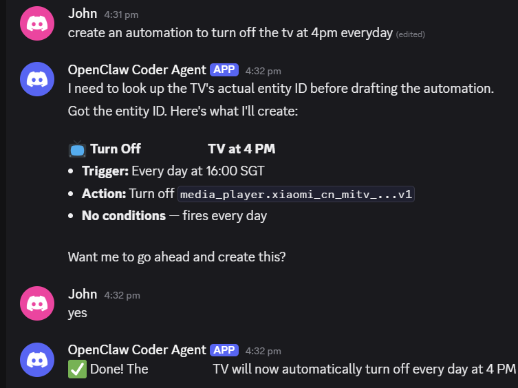

# SmartHub — AI-Powered Smart Home

Control your Home Assistant with natural language through any messaging app supported by OpenClaw (Discord, Telegram, WhatsApp, Feishu, and more). Powered by OpenClaw.

## How It Works

```
  "Turn off the lights"         "Set AC to 24"         "I'm leaving for work"
          │                          │                          │
          └──────────────────────────┼──────────────────────────┘
                                     │
                                     ▼
                        ┌────────────────────────┐
                        │   Your Messaging App   │
                        │ (Discord, Telegram, …) │
                        └───────────┬────────────┘
                                    │
                                    ▼
                        ┌────────────────────────┐
                        │      OpenClaw          │
                        │   (AI agent, Claude)   │
                        │                        │
                        │  Reads skill files in  │
                        │  tools/ to know how    │
                        │  to control devices    │
                        └───────────┬────────────┘
                                    │
                                    │ MCP protocol (stdio)
                                    │
                        ┌────────────────────────┐
                        │       ha-mcp 7.2.0     │
                        │  (~90 structured tools)│
                        │                        │
                        │  WebSocket to HA,      │
                        │  state verification,   │
                        │  tool search           │
                        └───────────┬────────────┘
                                    │
                                    ▼
                        ┌────────────────────────┐
                        │   Home Assistant        │
                        │      (Docker)           │
                        └───────────┬────────────┘
                                    │
                    ┌───────────────┼───────────────┐
                    ▼               ▼               ▼
                 Lights           AC/TV          Sensors
                Switches        Cameras         Cookers
```

Say "I'm leaving for work" and OpenClaw turns off lights, sets the AC to eco, and confirms what it did.

---

## macOS Support

SmartHub now supports two install paths: Raspberry Pi for the full runtime, and macOS for the official Home Assistant VM path.

- `install.sh` on the macOS host checks or installs VirtualBox, detects whether the Mac is Intel or Apple Silicon, and downloads the matching Home Assistant OS disk image.
- Intel Macs use the official `haos_ova` VirtualBox image.
- Apple Silicon Macs use the official `haos_generic-aarch64` VirtualBox image.
- The installer creates a bridged VirtualBox VM, attaches the matching disk image, starts Home Assistant OS, creates the initial Home Assistant admin account, and generates a long-lived access token.
- Keep the Mac powered on and on the home LAN while you expect local discovery or direct device control.

**Native macOS Docker Desktop is not supported** for the SmartHub runtime.

`install.sh` on macOS now waits for Home Assistant to boot, seeds the first admin account, and syncs the generated long-lived access token into `.env` before handing you the login URL.
If you need the full SmartHub runtime, run this repo on a Raspberry Pi and use macOS only as the Home Assistant VM host.

---

## Quick Install

If OpenClaw is already running on the machine that will host SmartHub, tell your bot to run the one-command installer:

```bash
curl -fsSL https://raw.githubusercontent.com/caiwang0/smarthome-openclaw/main/install.sh -o /tmp/smarthub-install.sh && bash /tmp/smarthub-install.sh
```

The installer auto-detects the host:

- On Raspberry Pi, it syncs the SmartHub repo, installs the runtime, starts Home Assistant, bootstraps the initial Home Assistant account if needed, and syncs the generated token into `.env`.
- On macOS, it detects Intel vs Apple Silicon, downloads the matching official Home Assistant OS VirtualBox image, starts the VM, bootstraps the initial Home Assistant account if needed, and syncs the generated token into `.env`.

OpenClaw will install everything and continue setup automatically. On a fresh install it prints the generated Home Assistant username/password once, then hands you the login URL.

---

## Full Setup

Pick the platform path that matches where SmartHub will actually run.

### 1. Install OpenClaw on the Target Machine

Install OpenClaw on the same machine that will host SmartHub. Go to [openclaw.ai](https://openclaw.ai/) to install it.

**Raspberry Pi**

**macOS host**

Install OpenClaw on the Mac that will host the Home Assistant OS VM. SmartHub does not run Home Assistant directly on macOS.

### 2. Set Up OpenClaw with a Messaging App

Follow the [OpenClaw Getting Started guide](https://docs.openclaw.ai/start/getting-started) to connect a bot to your messaging app (Discord, Telegram, WhatsApp, Feishu, etc.) and point it at this repo.

Make sure the bot is connected to the same machine that will host SmartHub.

### 3. Tell OpenClaw to Install SmartHub

Once the bot comes online, tell it to run the one-command installer:

```bash
curl -fsSL https://raw.githubusercontent.com/caiwang0/smarthome-openclaw/main/install.sh -o /tmp/smarthub-install.sh && bash /tmp/smarthub-install.sh
```

The installer auto-detects the host:

- On Raspberry Pi, it installs the SmartHub runtime, starts Home Assistant, bootstraps the initial Home Assistant admin account if needed, and syncs the generated token into `.env`.
- On macOS, it boots the matching Home Assistant OS VM in VirtualBox, bootstraps the initial Home Assistant admin account if needed, and syncs the generated token into `.env`.

---

## What OpenClaw Sets Up For You

| Step | What happens |
|------|-------------|
| Repo sync | Clones SmartHub if missing, or updates the existing checkout before setup |
| Install Docker | Checks if Docker is installed and gives you the command if not |
| Start Home Assistant | Launches HA on Raspberry Pi or boots the HA OS VM on macOS |
| First HA login | On a fresh install, bootstraps the initial Home Assistant admin account and prints the generated username/password once |
| Access token | Generates or recovers the Home Assistant token automatically and syncs it into `.env` |
| Verify runtime | Verifies `ha-mcp`, Home Assistant reachability, and the repo config before handoff |
| Add integrations | Walks you through adding Xiaomi, Philips Hue, or any other brand |
| Discover devices | Shows what devices were found after each integration |
| Remote access *(optional)* | Sets up a Cloudflare Tunnel so you can reach HA from anywhere |

### Example Conversation

```
You:      Help me set up SmartHub
OpenClaw: I'll sync the SmartHub repo locally and run the installer from the repo root.
          It will start Home Assistant, bootstrap the first login if needed,
          and sync the HA token into .env automatically.

OpenClaw: SmartHub + ha-mcp installed.
          Home Assistant admin username: alice
          Home Assistant admin password: <generated-password>
          Save this, it's the only time you'll see it.
          Open http://homeassistant.local:8123 in your browser and sign in.

You:      I'm signed in.
OpenClaw: Connection verified — Home Assistant 2026.3.4, 0 devices.
          Want to add your first device integration?
```

---

## After Setup

Talk to OpenClaw naturally:

| You say | What happens |
|---------|-------------|
| "Turn off the living room lights" | Controls the device via HA |
| "Set the AC to 24" | Calls the climate service |
| "I'm leaving for work" | Turns off lights, sets AC to eco, locks doors |
| "Why is the bedroom so hot?" | Checks sensors, AC state, diagnoses the issue |
| "What devices do I have?" | Lists all connected devices by room |
| "Turn off the TV at 3pm every day" | Creates an automation |
| "Add Xiaomi Home" | Walks you through the integration setup |

---

## Safety

Destructive actions are protected by **two layers**:

1. **`CLAUDE.md` rule** — the agent is told to show you a summary and wait for an explicit "yes" before any persistent change. A soft hint; the model usually follows it, but can rationalize past it under pressure.
2. **`scripts/approval-gate.py` hook** — a Claude Code PreToolUse hook that reads your latest message and **denies the call unless it contains an affirmative** (`yes`, `confirm`, `ok`, `好`, `sí`, `はい`, …). Deterministic — fires regardless of model or permission mode.

**What's gated:**

| Category | Examples |
|----------|----------|
| Automations & Scripts | create, modify, delete |
| Integrations | add, remove, enable/disable |
| Devices | remove, rename, update |
| System | restart, reload core, backup restore |
| HACS | add repository, download |

Non-destructive actions (turning on lights, setting AC, reading state) run without confirmation — only changes that persist across restarts are gated.

**How it works:** The hook is wired in `.claude/settings.json` to match the destructive tool names above. On each matched call, it reads the conversation transcript, pulls your last message, and checks it against the affirmative patterns. No match → deny → the agent has to show a summary and ask first.

**Example — creating an automation:**



The agent shows a summary, waits for "yes", then executes. Skip the "yes" and the hook blocks the call.

---

## Project Structure

```
home-assistant/
├── CLAUDE.md                    # Agent behavior rules (auto-loaded)
├── TOOLS.md                     # Skill router — maps devices to files
├── docker-compose.yml           # Runs Home Assistant
├── install.sh                   # Raspberry Pi installer + macOS host bootstrap dispatcher
├── .env.example                 # Template — copy to .env, fill in HA_TOKEN
├── .claude/
│   └── settings.json            # ha-mcp MCP server + PreToolUse approval hook
│
├── scripts/
│   ├── approval-gate.py         # Blocks destructive ha-mcp calls unless the user
│   │                            # explicitly confirmed in their latest message
│   ├── macos-vm-bootstrap.sh    # VirtualBox + Home Assistant OS VM bootstrap on macOS hosts
│   └── linux-guest-install.sh   # SmartHub runtime install on Raspberry Pi hosts
│
├── tools/                       # Skill files — the agent's knowledge base
│   ├── setup.md                 #   First-run setup flow (Docker → HA → token → .env)
│   ├── _common.md               #   ha-mcp tool patterns, network info
│   ├── _errors.md               #   Error handling & recovery
│   ├── _services.md             #   Domain quirks (HVAC modes, brightness 0-255, etc.)
│   ├── integrations/
│   │   ├── _discovery.md        #   Read-only discovery (passive signals + ordered LAN fallback chain)
│   │   ├── _lifecycle.md        #   Integration lifecycle harness (selection → connection → verification)
│   │   └── _guide.md            #   Config-flow sub-skill (HACS, OAuth, recovery during CONNECTING)
│   ├── automations/
│   │   ├── _guide.md            #   Automation workflow & checklist
│   │   └── _reference.md        #   JSON schema, trigger/action types, templates
│   ├── ha-best-practices/
│   │   ├── SKILL.md             #   Vendored Home Assistant automation/helper guidance
│   │   └── references/          #   Supporting best-practices references loaded during drafting
│   ├── xiaomi-home/
│   │   ├── _integration.md      #   Xiaomi setup, cloud regions, quirks
│   │   ├── tv.md                #   TV commands & quirks
│   │   ├── ma8-ac.md            #   AC commands & quirks
│   │   └── p1v2-cooker.md       #   Smart cooker commands & quirks
│   └── printer/
│       └── office-printer.md    #   CUPS printer setup
│
├── ha-config/                   # HA configuration (Docker volume, gitignored)
└── docs/                        # Research, specs, design docs
```

### How the Agent Finds Knowledge

```
CLAUDE.md (always loaded)
    │
    ├─ First-run check fails ────────→ reads tools/setup.md
    │                                   (Docker / HA / token / .env bootstrap)
    │
    ├─ "Before controlling a device" → reads tools/_common.md for ha-mcp patterns
    │                                   then device skill file for commands & quirks
    │                                   then tools/_services.md if unsure about a service
    │                                   then tools/_errors.md if a call fails
    │
    ├─ "Before creating automation" ─→ reads tools/automations/_guide.md
    │                                   then tools/ha-best-practices/ during Step 4 draft creation
    │                                   then _reference.md for JSON schema
    │
    └─ "Before adding integration" ──→ reads tools/integrations/_discovery.md
                                        then tools/integrations/_lifecycle.md
                                        then tools/integrations/_guide.md when in CONNECTING

TOOLS.md (loaded on demand)
    └─ Quick Reference table maps device names → skill files

Destructive ha-mcp calls (create/modify/delete automations, scripts, integrations,
devices, backups, restarts, HACS downloads)
    └─ scripts/approval-gate.py runs as a Claude Code PreToolUse hook and blocks
       the call unless the user's latest message is an explicit "yes / confirm"
```

Skill files are loaded **on demand**, not all at once. The agent only reads what it needs for the current task — this keeps the LLM context small and replies fast.

---

## Requirements

- **OpenClaw CLI** — the AI agent framework
- **Docker** — runs Home Assistant
- **uv** — Python package manager for running ha-mcp
- **A messaging platform** — Discord, Telegram, WhatsApp, Feishu, or any platform supported by OpenClaw
- **Claude API access** — OpenClaw uses Claude as its backend

## Troubleshooting

**Bot doesn't respond:**
- Check the bot is online in your messaging app
- Verify your channel config in `openclaw.json` is correct — see the [OpenClaw Getting Started guide](https://docs.openclaw.ai/start/getting-started)
- Check logs: `openclaw gateway logs --profile smarthub`

**HA is unreachable:**
- Run `docker ps` — is `homeassistant` running?
- Test: `curl http://localhost:8123/api/config -H "Authorization: Bearer YOUR_TOKEN"` — should return config JSON with fields like `version`, `state`, and `config_source`
- Check `.env` has the correct token

**OAuth redirect fails (Xiaomi, Google, etc.):**

The OAuth login redirects to `homeassistant.local:8123` (or whichever port HA is running on — check `HA_URL` in `.env`). In the Raspberry Pi runtime path, `homeassistant.local` belongs to the Raspberry Pi, not the browser machine.

First, on the Raspberry Pi, get the host IP:

```bash
HA_HOST_IP=$(hostname -I | awk '{print $1}')
```

Then update the hosts file on the browser machine that is opening the OAuth link.

*Windows* — run Command Prompt as administrator:


Then paste the command OpenClaw gave you:


*Mac / Linux browser machine:*
```bash
echo "${HA_HOST_IP} homeassistant.local" | sudo tee -a /etc/hosts
```

**Tunnel not working:**
- Check `cloudflared` is running: `ps aux | grep cloudflared`
- Verify `trusted_proxies: 127.0.0.1` under `http:` in HA's `configuration.yaml`
